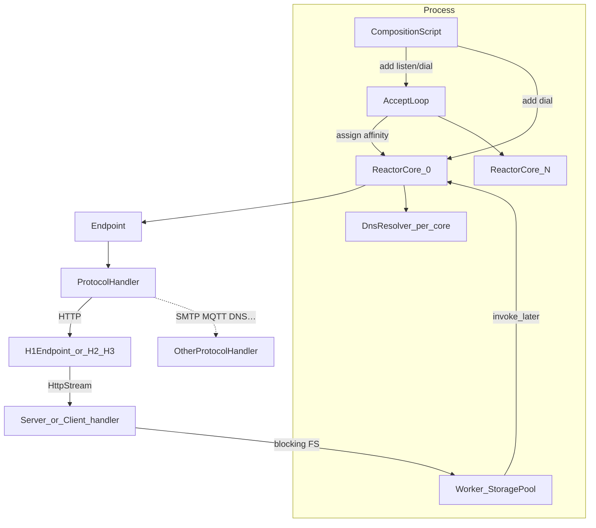

# Hopf — Implementation Tranches

This is the executable implementation plan for Hopf. Architectural
decisions live in [PLAN.md](PLAN.md). This file is the tranche breakdown
agents and contributors should follow.

Status: **Tranche 8 complete** (composition builder, dynamic bindings, TrustPolicy +
HTTP Basic, CIDR/rate limits, quota/telemetry seams). **DNS** (`hopf-dns`)
landed alongside. **Tranche 7** (QUIC + H3) and **Tranche 6** (H2) remain the
HTTP substrate. Design locks from GitHub
[#1](https://github.com/cpkb-bluezoo/hopf/issues/1)–[#8](https://github.com/cpkb-bluezoo/hopf/issues/8)
are reflected below.

---

## Parser model

Do **not** call the stack “push SAX.” That conflates two axes:

| Axis | Classic SAX | Hopf / sibling parsers |
| ---- | ----------- | ---------------------------- |
| **Egress** (events out) | Handler callbacks as units are recognized | Same idea: format-specific handler traits, borrowed `&[u8]` / `&str` |
| **Ingress** (bytes in) | Synchronous, blocking parse until end of stream | **Incremental, chunk-based, resumable** |

Name the pattern **incremental push parser** (streaming/resumable ingress +
handler egress). SAX is only a loose analogy for the callback surface.

### Shared lexer + grammar-driven tokens ([#3](https://github.com/cpkb-bluezoo/hopf/issues/3))

**Structured protocols** share
[`hopf_core::ByteStreamLexer`](crates/hopf-core/src/byte_stream_lexer.rs)
(Gumdrop lineage: zero-copy windows, `enter_raw`, token cap, rewind,
`HandlerControl`). Protocol crates supply `consume` + **token enums driven by
the protocol grammar** — not a universal “whole line” event.

- Prefer fine tokens (e.g. HTTP request-line: `Method` → `SP` → `Target` → `SP`
  → `Version` → `CRLF`). Update **parse FSM** as each production completes.
- CRLF remains a production where the grammar has it; it is **not** the only
  scheduler for state changes.
- Early parse state ≠ early application callbacks (do not enter
  `HttpRequestHandler` before the message is sufficiently validated).
- HTTP/1.x uses grammar-driven `Word` / `Sp` / `Colon` / `Text` / `Crlf` (issue #3).
- Binary / length-prefixed / frame protocols use the same push contract without
  pretending to be line-oriented.

Ingress contract — same shape as sibling parsers
([rjsonparser](../rjsonparser) /
[rmimeparser](../rmimeparser) /
[rprotobuf](../rprotobuf) /
[tractrix](https://crates.io/crates/tractrix)):

```rust
fn new(handler: &mut H) -> Self;
fn receive(&mut self, data: &mut &[u8]) -> Result<()>; // advances slice; may underflow
fn is_underflow(&self) -> bool;
fn close(&mut self) -> Result<()>;  // EOF validation — not "parse the rest blocking"
fn reset(&mut self);
```

Reactor loop: fill buffer → `parser.receive(&mut slice)` → compact unconsumed →
wait for more readiness. Never parse-to-EOF on the reactor thread.

---

## Decisions locked here

| Topic | Decision |
| ----- | -------- |
| First protocol vertical | **HTTP/1.1**, then H2 on the same Stream app API; H3 in-tree on QUIC |
| Crate layout | **Cargo workspace** (below) |
| Servlet container | **Out of scope** |
| Codec style | Incremental push + **grammar-driven** tokens ([#3](https://github.com/cpkb-bluezoo/hopf/issues/3)) |
| Product identity | **Networking framework** — listen **and** dial ([#1](https://github.com/cpkb-bluezoo/hopf/issues/1)) |
| Bindings | **All dynamic**; config is a script over Runtime APIs ([#6](https://github.com/cpkb-bluezoo/hopf/issues/6)) |
| Composition | Runtime + script; declarative **XML via tractrix**; no DI ([#8](https://github.com/cpkb-bluezoo/hopf/issues/8)) |
| TLS / QUIC | **rustls** + **quinn-proto**; in-tree H3 ([#7](https://github.com/cpkb-bluezoo/hopf/issues/7)) |
| HTTP app boundary | Transport-agnostic **HTTP Stream** ([#5](https://github.com/cpkb-bluezoo/hopf/issues/5)) |
| Auth vocabulary | **TrustPolicy** + **IdentityMaterial** ([#2](https://github.com/cpkb-bluezoo/hopf/issues/2)) |
| DNS | **Reactor-affine** dial substrate ([#4](https://github.com/cpkb-bluezoo/hopf/issues/4)) |
| Tranche 5 | **Skipped** — no static-file PoC; filesystem HTTP = WebDAV + tractrix |

Still deferred: PEM vs PKCS#12, allocator, C ABI, io_uring.

---

## Target shape (Gumdrop without servlet)

Preserve Gumdrop’s layering; do not invent a Hyper-shaped or async-runtime stack.



**Core contracts (behaviour, not Java names 1:1):**

- **Runtime** — reactors, timers, buffers, storage, **binding table**, DNS
  defaults; role-agnostic
- **Binding** — **listen** or **dial** ([#1](https://github.com/cpkb-bluezoo/hopf/issues/1), [#6](https://github.com/cpkb-bluezoo/hopf/issues/6));
  `Listener` / `Connector` (`TcpListenerConfig` / `TcpConnectorConfig`) are peers;
  no frozen “static listener” source of truth
- **Endpoint** — plaintext `send` / `close` / `start_tls` / pause/resume /
  write-ready / timers / `execute` (TCP, QUIC stream, …)
- **ProtocolHandler** — `connected` / `receive` / `disconnected` /
  `security_established` / `error` on the reactor thread only
- **Storage / worker pool** — hop back with `invoke_later`
- **Composition** — `Service` (or successor) runs the startup **script**; it does
  not own an immutable port list ([#8](https://github.com/cpkb-bluezoo/hopf/issues/8))

**Transport taxonomy ([#5](https://github.com/cpkb-bluezoo/hopf/issues/5)):**
TCP endpoint · UDP endpoint (datagrams) · QUIC stream endpoint · multiplexed
QUIC connection.

**HTTP app surface** (servlet-independent, peer-symmetric):

```text
Bind or Dial ──► Endpoint(s) ──┬── H3: Stream ↔ QuicStream Endpoint ──┐
                               ├── H2: many Streams on one TCP Endpoint ├─► HttpStream ─► server | client
                               └── H1: one Stream at a time on TCP ────┘
```

- **`HttpStream`** + server / client handlers — same for H1/H2/H3; **no**
  TCP/QUIC types in the handler API
- H1 presents Streams via `H1Endpoint`; H2/H3 plug into the same Stream API
- Listen (`http-hello`) and dial (`http-get`) are twin smokes; only setup differs
**Auth ([#2](https://github.com/cpkb-bluezoo/hopf/issues/2)):** TrustPolicy +
IdentityMaterial on listen **and** dial; Realm may be one TrustPolicy impl.

**Explicitly not porting:** `javax.servlet*`, cookies/sessions as container
features, JSP, reflective XML DI. Multipart **mail** uses `rmimeparser`; servlet
form APIs stay out of scope.

---

## Workspace layout

```
hopf/
  Cargo.toml                 # workspace + path deps to sibling parsers
  crates/
    hopf-core/         # TPC reactor, Endpoint, bindings, Service, buffers, timers
    hopf-tls/          # rustls (TCP TLS + STARTTLS; shared identity for QUIC)
    hopf-http/         # H1 (+ H2/HPACK + in-tree H3); Stream app API
    hopf-quic/         # quinn-proto + mio glue; QuicStreamEndpoint
    hopf-dns/          # stub resolver + caching forwarder (UDP/TCP/DoT/DoQ/DoH)
    # later: hopf-auth, …
  examples/
    echo/                    # tranche 1 smoke
    http-hello/              # tranche 4 listen / server smoke
    http-get/                # tranche 4 dial / client twin
    tls-echo/                # tranche 3 smoke
    dns-proxy/               # DNS UDP caching forwarder
```
**Workspace `Cargo.toml` hard deps:** `mio`, `rustls`, `quinn-proto`, plus sibling
parsers from **crates.io**: `tractrix`, `rjsonparser`, `rmimeparser`, `rprotobuf`.

Keep `hopf-core` free of HTTP. Protocols depend on core (+ tls as needed).
Do **not** add Hyper/Axum/Tower/serde or an async app runtime as architecture.

To hack on a sibling parser locally, override with `[patch.crates-io]` path deps
(do **not** vend copies into this tree). **WebDAV** and **composition XML** both
use **tractrix**. There is **no** `http-static` example (Tranche 5 skipped).

---

## Tranches

Each tranche ends with mergeable, demonstrable behaviour and tests. Do not start
the next protocol feature until the previous tranche’s exit criteria pass.

### Tranche 0 — Skeleton

**Scope:** Workspace, crate stubs, README expansion from PLAN, CI
(`cargo check` / `test`), license already `LICENSE`.

**Exit:** Empty crates compile; documented layout; no runtime yet.

---

### Tranche 1 — TPC reactor + TCP Endpoint

**Scope** (Gumdrop `SelectorLoop` / `AcceptSelectorLoop` / `TCPEndpoint`):

- Per-core mio reactors; accept loop fan-out
- Traits: `Endpoint`, `ProtocolHandler`, `Service`, `Listener` (TCP)
- Pooled buffers; timers; `execute` / registration queue
- Backpressure; panic isolation; TCP echo example

**Design for the whole shape (implement later):** UDP and QUIC stream endpoint
seams; `Connector` / dial; dynamic `add`/`remove` bindings (replace one-shot
`tcp_listeners()`); `start_tls` stub.

**Exit:** Multi-connection echo; affinity; unconsumed bytes across `receive`.

---

### Tranche 2 — Worker / storage executor

**Scope** (Gumdrop `StorageExecutor`): bounded pool; submit → `Endpoint::execute`;
file offload smoke; reject-on-full policy.

**Exit:** Reactor never blocks on FS.

---

### Tranche 3 — TLS (rustls)

**Scope:** TLS-from-accept + `start_tls`; plaintext above TLS; `SecurityInfo` /
ALPN; PEM-first.

**Exit:** TLS echo; ALPN on `security_established`.

**Dial peer:** `SharedTlsConnector` + TLS-from-dial (landed with
`Runtime::connect` / `http-get` symmetry).

---

### Tranche 4 — HTTP/1.1 protocol vertical (Stream-first + peer-symmetric)

**Status:** Stream-first rename landed — `HttpStream`, `H1Endpoint`, server /
client codecs; `http-hello` (listen/server) + `http-get` (dial/client) twins;
grammar-driven tokens (issue #3).

**Scope:**

In `hopf-core`:

0. **`ByteStreamLexer`** — shared structured-scan scaffold.
1. **`TcpConnectorConfig` + `Runtime::connect`** — peer of listener / accept
   ([#1](https://github.com/cpkb-bluezoo/hopf/issues/1)); Stage 0 =
   `SocketAddr` (DNS later).

In `hopf-http`:

1. **`HttpScanner`** — grammar-driven `Word` / `Sp` / `Colon` / `Text` / `Crlf`.
2. Incremental push H1 **server** + **client** codecs (CL / chunked /
   until-close, Host, TE, limits); split-buffer tests.
3. **`H1Endpoint`** as `ProtocolHandler` on one TCP Endpoint (bind or dial);
   role selects codec face.
4. **Stream-shaped** app API: `HttpStream` + `ServerHandler` / `ServerWriter` /
   `ClientHandler` / `ClientWriter` — H1 **adapts into** Stream; the
   public model is not “the TCP connection”
   ([#5](https://github.com/cpkb-bluezoo/hopf/issues/5)).
5. Response / request framing + auto chunked; `http-hello` + `http-get`.

**Out of tranche 4:** H2, WebSocket, WebDAV methods, cookies/sessions.

**Exit:** curl-compatible H1.1 server; dial twin prints response body;
Gumdrop-strict rejects where documented.

### Tranche 5 — ~~HTTP service + static files~~ **SKIPPED**

**Skipped.** Echo / `http-hello` already prove handler + Endpoint + TLS +
storage. Filesystem HTTP is **WebDAV**, not a GET/HEAD FileHandler slice.

**Uses [tractrix](https://crates.io/crates/tractrix)** for PROPFIND/PROPPATCH/lock XML (and later
composition XML). See [Tranche 9+](#tranche-9--further-gumdrop-protocols).

`HttpService` / `HttpListener` sugar can appear when a second listener pattern
is needed; bindings remain dynamic Runtime APIs.

---

### Tranche 6 — HTTP/2 + HPACK

**Status:** landed — in-tree HPACK + `H2Endpoint` + `AlpnHttpEndpoint` +
`CleartextHttpEndpoint`; h2c prior-knowledge + Upgrade negotiation; H2 client
constructor ready.

**Scope** (Gumdrop `http.h2` / `http.hpack`):

- In-tree HPACK; frames; stream/connection flow control; SETTINGS/PING/GOAWAY
- ALPN `h2`; same **`HttpStream`** / server|client handlers (one TCP
  `Endpoint` underneath)
- **h2c prior-knowledge** (`curl --http2-prior-knowledge`): `CleartextHttpEndpoint`
  sniffs the 24-byte client preface and switches to H2.
- **h2c Upgrade** (`curl --http2`): `CleartextHttpEndpoint` detects
  `Upgrade: h2c` + `HTTP2-Settings`, sends `101 Switching Protocols`, waits
  for the client preface, then hands off to `H2Endpoint::server_after_h2c_upgrade`.
- **H2 client** (`H2Endpoint::client`): writes preface + SETTINGS on connect,
  kicks off one request after SETTINGS exchange; wired in `http-get --http2`.
- No second app API

**TODO:** PUSH_PROMISE / server push; PRIORITY trees (deprecated in RFC 9113).

**Exit:** `curl --http2` and `curl --http2-prior-knowledge` against plaintext
`http-hello`; `http-get --http2` dials H2; server handlers unchanged on H2.

---

### Tranche 7 — QUIC + HTTP/3 (quinn-proto + rustls)

**Scope** ([#7](https://github.com/cpkb-bluezoo/hopf/issues/7)):

- **`quinn-proto`** transport state machine + **in-tree mio/TPC glue**
  (do not take the full `quinn` crate)
- Shared **rustls** identity/config with TCP TLS (`hopf-tls` PEM helpers /
  TLS 1.3 QUIC configs in `-quic`)
- `QuicStreamEndpoint` implementing `Endpoint`; multiplexed QUIC connection seams
  (`listen_quic` / `listen_quic_hooks` / `connect_quic`, `RuntimeQuicExt`)
- **In-tree** H3 / QPACK incremental push codecs in `hopf-http` (feature `h3`)
  → same **`ServerHandler`** app API (each H3 request ↔ one QUIC-stream `Endpoint`)
- H2 framing fidelity: `H2Parser` + zero-copy frame-handler pipeline; HPACK under `h2/hpack/`

**Exit:** `http3-hello` + `curl --http3-only`; UDP under QUIC stays inside `-quic`.

**Status:** Done (spike echo + H3 server/client + demos). Non-goals deferred:
server push, datagrams, WebTransport, full priority / 0-RTT polish.

---

### Tranche 8 — Cross-cutting substrate

**Status:** complete.

Port concepts so mail/MQTT/DNS/peers land on the same knobs:

- **TrustPolicy** / **IdentityMaterial** / SASL mechanisms in
  `hopf-auth` ([#2](https://github.com/cpkb-bluezoo/hopf/issues/2));
  **HTTP Basic, Digest, and Bearer** consumers (`BasicAuthFactory`,
  `DigestAuthFactory`, `BearerAuthFactory`). SASL: PLAIN, LOGIN, CRAM-MD5,
  DIGEST-MD5, SCRAM-SHA-256, OAUTHBEARER, EXTERNAL (GSSAPI out of scope)
- Connection rate limits / CIDR allow-deny on `TcpListenerConfig` / accept path
- Quotas skeleton (`QuotaTracker` / `CounterQuota`)
- Telemetry hooks on Runtime (`TelemetryHook`); exporters in
  **`hopf-otel`** (batched OTLP/HTTP + JSONL, off hot-path);
  HTTP Stream traces/metrics via `InstrumentedServerFactory` (config
  `traces_enabled` / `metrics_enabled`; `ServerWriter::traceparent` +
  `with_traceparent` for outbound clients)
- **Composition** builder (`Composition` / `CompositionRuntime`) as canonical
  script surface ([#8](https://github.com/cpkb-bluezoo/hopf/issues/8));
  **XML loader** via **tractrix** (`Composition::from_xml` + closed
  `CompositionRegistry` of `HandlerFactory` names — no DI)
- Dynamic binding `add`/`remove` via `BindingId` ([#6](https://github.com/cpkb-bluezoo/hopf/issues/6));
  `Service::tcp_listeners` default empty / transitional

**Exit:** Composition starts Runtime and adds/removes a TCP listener; CIDR deny
before `ProtocolHandler::connected`; Basic auth challenge/success via TrustPolicy.

---

### DNS under dial + `hopf-dns` (Gumdrop parity)

**Status:** landed (stub resolver + caching forwarder; not authoritative).

Not only a late product ([#4](https://github.com/cpkb-bluezoo/hopf/issues/4)).
Crate **`hopf-dns`** delivers:

| Stage | Behaviour |
| ----- | --------- |
| **0** | Dial by `SocketAddr` only (historical) |
| **1** | Per-reactor UDP A/AAAA + shared cache + timeout + `RuntimeDnsExt::connect_by_name` |
| **2** | TCP truncation, CNAME, hosts, EDNS/cookies/bailiwick, DoT/DoQ/DoH, DNSSEC hooks |
| **Server** | Caching forwarder (`DnsService`) + UDP / DoT / DoQ listeners (`examples/dns-proxy`) |

Non-goals (Gumdrop same): authoritative zones, AXFR/IXFR, TSIG, UPDATE, DNSSEC signing, DoH server.

---

### Tranche 9+ — Further Gumdrop protocols

Each protocol is its own tranche: `*Service` pattern as composition sugar +
`*ProtocolHandler` + incremental push codec + storage where needed. Prefer
**server and client roles** in the same crate where Gumdrop has both ([#1](https://github.com/cpkb-bluezoo/hopf/issues/1)).

Suggested order: **WebSocket** → **SMTP/IMAP** (`rmimeparser`) → MQTT → SOCKS → FTP.
Do not parallelize until Endpoint is battle-tested by HTTP/2.

**WebDAV** (replaces skipped T5): full Gumdrop `webdav` using **tractrix** for
wire XML. **Composition XML loader** (registry-based, no DI) is already in
`hopf-core` (`Composition::from_xml`); WebDAV reuses the same tractrix
dependency for PROPFIND/PROPPATCH bodies.

---

## What each tranche must not do

- Pull in an async app runtime, Hyper, Axum, Tower, or serde as architecture
- Use the full **`quinn`** crate instead of **quinn-proto** + mio glue
- Block reactor threads on disk, DNS, or app logic
- Block on parse-to-EOF ingress
- Materialise full HTTP messages as owned DOM objects on the hot path
- Leak TCP/QUIC types into `HttpRequestHandler`
- Port servlet APIs or reflective XML DI
- Implement “all of Gumdrop” in one PR

---

## Reference map

| Hopf | Gumdrop / siblings |
| ---------- | ------------------ |
| Reactor / accept / dial | `SelectorLoop`, `AcceptSelectorLoop`, `ClientEndpoint` |
| Endpoint / handler | `Endpoint.java`, `ProtocolHandler.java` |
| Storage | `StorageExecutor` |
| HTTP wire / Stream | `http/HTTPProtocolHandler.java`, `Stream.java` |
| HTTP app | `HTTPRequestHandler.java`, `HTTPResponseState.java` |
| QUIC transport | **quinn-proto** + rustls |
| WebDAV + composition XML | Gumdrop `webdav/*` + config docs; **tractrix** |
| JSON / MIME / protobuf | `../rjsonparser`, `../rmimeparser`, `../rprotobuf` |
| Auth | Gumdrop `auth` → TrustPolicy / IdentityMaterial |
| DNS under dial / forwarder | Gumdrop `DNSResolver.forLoop` / `DNSService` |
